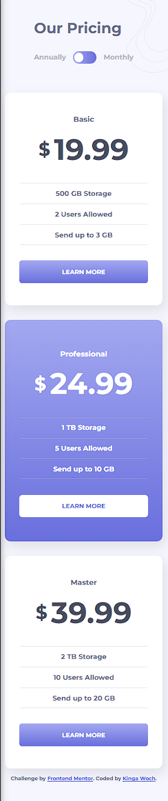
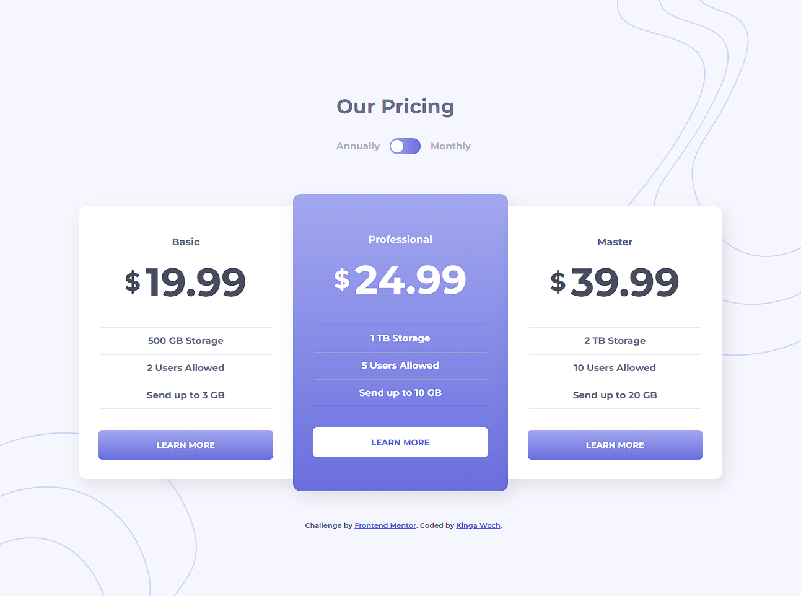

# Frontend Mentor - Pricing component with toggle solution

This is a solution to the [Pricing component with toggle challenge on Frontend Mentor](https://www.frontendmentor.io/challenges/pricing-component-with-toggle-8vPwRMIC). Frontend Mentor challenges help you improve your coding skills by building realistic projects.

## Table of contents

- [Overview](#overview)
  - [The challenge](#the-challenge)
  - [Screenshot](#screenshot)
  - [Links](#links)
- [My process](#my-process)
  - [Built with](#built-with)
- [Author](#author)

## Overview

### The challenge

Users should be able to:

- View the optimal layout for the component depending on their device's screen size
- Control the toggle with both their mouse/trackpad and their keyboard

### Screenshot

### Links

- Live Site URL: [Live Site at Netlify](https://pricing-component-with-toggle-kw.netlify.app/)

## My process

### Built with

- Semantic HTML5 markup
- CSS custom properties
- Flexbox
- CSS Grid
- Mobile-first workflow
- JS

## Author

- Website - [Kinga Woch](https://kinga-woch.netlify.app)
- Github - [Kinga Woch](https://github.com/KingaWoch)
- Frontend Mentor - [@KingaWoch](https://www.frontendmentor.io/profile/KingaWoch)
